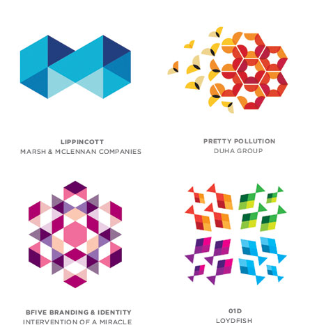

layout: true
class: middle, center

---

## Day 04
# Trends, Fads and Plagiarism

---

**Fad**: fleeting behaviour, generally negative, "flavour of the month"

__Trend__: behaviour that promotes change and evolution, progress, permanent shift in direction

__Plagiarism__: no new creative input, technical deconstruction of logo to meet brand requirements

---

# "Imitation is the sincerest form of flattery"


_-- Charles Caleb Colton_

---


---


---


---


```
Discussion: 
Imitation is the 
sincerest form of flattery
```

---

# Should we even care about trends?

Shouldn't we just try to be original and approach the solution a priori?

---

# The Value of Trends

* Understand the Zeitgeist
* Logo feels current
* Client feels "hip"
* When appropriate, trends are a quick "shorthand"


---

# Use Trends Appropriately

* Look for inspiration, not treatment
* When did a trend solve the problem?
* Think holistically - not just logo design
* What are the "macro" trends? How do they apply?

---

# Trend vs. Treatment

## Treatment




---

# Trend vs. Treatment

## Trend (2010)


